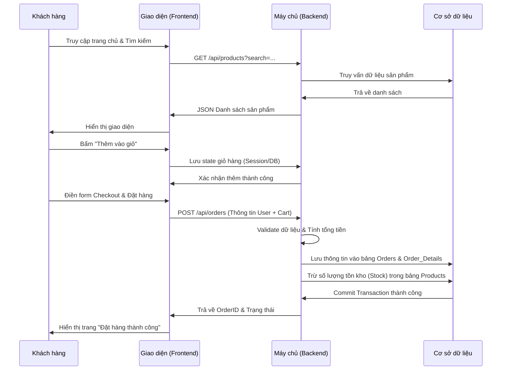

# PHÂN TÍCH YÊU CẦU

### 1. Mục tiêu và phạm vi dự án 
- Mục tiêu: Xây dựng một nền tảng thương mại điện tử hoàn chỉnh (B2C), cung cấp trải nghiệm mua sắm mượt mà cho khách hàng và công cụ quản lý toàn diện cho chủ cửa hàng. Hệ thống được thiết kế theo kiến trúc chuẩn để đảm bảo tính mở rộng trong tương lai.
- Phạm vi dự án:
    - Quản lý luồng mua hàng (Shopping Cart -> Checkout -> Order Tracking).
    - Quản lý danh mục, sản phẩm và biến thể (size, màu sắc).
    - Tích hợp thanh toán COD (Cash on Delivery) làm nền tảng.
### 2. Phân tích yêu cầu chức năng
### 2.1. Nhóm khách (chưa đăng ký/đăng nhập -> Guest) và khách hàng (Customer)

| Nhóm chức năng | Chi tiết chức năng | Yêu cầu đầu ra |
| :--- | :--- | :--- |
| **Quản lý Tài khoản** | Đăng ký & Đăng nhập   Quên mật khẩu (Khôi phục qua Email OTP)| Quản lý thông tin cá nhân & Địa chỉ giao hàng mặc định. |
| **Danh mục và khám phá** | Xem, tìm kiếm, filter, sort | Hiển thị sản phẩm theo danh mục đa cấp (Category tree).   Bộ lọc (Filter) theo giá, thuộc tính (màu, size).   Tìm kiếm toàn văn bản (Full-text-search) theo tên/mô tả.   Sắp xếp (Mới nhất, Giá tăng/giảm, Bán chạy)|
| **Giỏ hàng** | Thêm/ Sửa/ Xóa | Thêm sản phẩm vào giỏ, thay đổi số lượng mua.   Xóa sản phẩm khỏi giỏ.   Dữ liệu giỏ hàng không bị mất khi tải lại trang. |
| **Theo dõi** | Lịch sử đơn hàng |Theo dõi trang thái của các đơn đã đặt và trạng thái hiện tại của đơn hàng. |

### 2.2. Nhóm Quản trị viên (Admin)

| **Quản lý Sản phẩm (PIM)** | **Xử lý Đơn hàng (OMS)** |
| :--- | :--- |
| Quản lý danh mục (Tạo cây thư mục).   CRUD sản phẩm: Tên, giá gốc, giá khuyến mãi, số lượng kho.   Quản lý hình ảnh (Upload nhiều ảnh/sản phẩm).   Quản lý thuộc tính biến thể.| Xem danh sách toàn bộ đơn hàng, lọc theo ngày/trạng thái.   Cập nhật trạng thái luồng đơn hàng: Chờ xác nhận -> Đang giao -> Hoàn thành.   Xem chi tiết thông tin người nhận và danh sách mặt hàng đã mua. |

### 3. Luồng nghiệp vụ cốt lõi (Core Business Flow)

*Dưới đây là sơ đồ tuần tự (Sequence Diagram) mô tả luồng tương tác khi khách hàng thực hiện mua một sản phẩm: từ lúc truy cập, thêm vào giỏ hàng, cho đến khi hoàn tất thanh toán.*

### 4. Phân tích yêu cầu phi chức năng (Non-Functional)
- Tính tương thích (Responsive Design):
    - Giao diện Responsive Design, đảm bảo tương tác vuốt/chạm (touch-friendly) trên thiết bị di động (Mobile First) và tương thích các trình duyệt chuẩn.
- Hiệu suất (Performance):
    - Thời gian phản hồi (TTFB) cho các API liệt kê sản phẩm dưới 500ms. Hình ảnh sản phẩm phải được tối ưu dung lượng trước khi lưu trữ.
- Bảo mật cơ bản (Security):
    - Áp dụng JWT (JSON Web Token) hoặc Session để duy trì đăng nhập. Không lưu mật khẩu dạng plaintext (Sử dụng bcrypt). Validate chặt chẽ dữ liệu đầu vào chống SQL Injection/XSS.

# ĐẶC TẢ & THIẾT KẾ HỆ THỐNG

### 1. Thiết kế hệ thống (System Architecture)
Trình bày cách mảnh ghép giúp cho website hoạt động đồng bộ. Sử dụng mô hình **Client - Server** làm chuẩn
- **Client (Frontend)**: Trình duyệt của người dùng (Chrome). Giao diện web chịu trách nhiệm thu thập thao tác của người dùng gửi các yêu cầu (Request) thông qua các giao thức HTTP/HTTPS.
- **Server (Backend)**: Máy chủ nhận yêu cầu, xử lý logic (tính toán giỏ hàng, xác thực đăng nhập) và trả về kết quả (Response).
- **Databse (Cơ sở dữ liệu)**: Nơi lưu giữ thông tin thực tế. Để bảo mật, chỉ có Server mới được quyền nói chuyện trực tiếp với Database, Client tuyệt đối không được truy cập.

### 2. Đặc tả Cơ sở dữ liệu (Database Schema)

#### Bảng 1: Users
*Lưu trữ tài khoản và phân quyền quản trị.*
| **Tên trường (Field)** | **Kiểu dữ liệu (Type)** | **Ràng buộc (Constrant)** | **Mô tả chi tiết** |
| :--- | :--- | :--- |:--- |
| id | INT | Primary Key, Auto Increment | Mã định danh người dùng. |
| email | VARCHAR(100) | Unique, Not Null | Email đăng nhập. |
| password | VARCHAR(255) | Not Null | Mật khẩu (Đã được bam/hashed). |
| full_name | VARCHAR(100) | Not Null | Họ và tên khách hàng. |
| phone | VARCHAR(15) | Nullable | Số điện thoại liên hệ. |
| role | ENUM | Default:'customer" | Vai trò. |

#### Bảng 2: Categories

| **Tên trường (Field)** | **Kiểu dữ liệu (Type)** | **Ràng buộc (Constrant)** | **Mô tả chi tiết** |
| :--- | :--- | :--- |:--- |
| id | INT | Primary Key, Auto Increment | Mã định danh danh mục. |
| name | VARCHAR(100) | Not Null | Tên danh mục. |

#### Bảng 3: Products

| **Tên trường (Field)** | **Kiểu dữ liệu (Type)** | **Ràng buộc (Constrant)** | **Mô tả chi tiết** |
| :--- | :--- | :--- |:--- |
| id | INT | Primary Key, Auto Increment | Mã định danh sản phẩm. |
| category_id | INT | Foreign Key | Trỏ tới id của bảng Categories. |
| name | VARCHAR(255) | Not Null | Tên sản phẩm. |
| price | DECIMAL(10,2) | Not Null | Giá bán hiện tại. |
| stock | INT | Default: 0 | Số lượng tồn kho. |
| image_url | VARCHAR(255) | Nullable | Đường dẫn ảnh sản phẩm. |

#### Bảng 4: Orders
*Lưu trữ thông tin tổng quan của một lần thanh toán.*

| **Tên trường (Field)** | **Kiểu dữ liệu (Type)** | **Ràng buộc (Constrant)** | **Mô tả chi tiết** |
| :--- | :--- | :--- |:--- |
| id | INT | Primary Key, Auto Increment | Mã đơn hàng. |
| user_id | INT | Foreign Key | Trỏ tới id của bảng Users. |
| total_amount | DECIMAL(10,2) | Not Null | Địa chỉ giao hàng. |
| shipping_address | TEXT | Not Null | Họ và tên khách hàng |
| status | ENUM | Default: 'pending' | Trạng thái:   'pending'   'shipping'   'completed'.|
| created_at | TIMESTAMP | Default: Current_Time | Thời gian đặt hàng. |

#### Bảng 5: Order_Details 
*Giải quyết mối quan hệ nhiều-nhiều. Một đơn hàng có thế có nhiều sản phẩm, một sản phẩm có thể nằm trong nhiều đơn hàng.*

| **Tên trường (Field)** | **Kiểu dữ liệu (Type)** | **Ràng buộc (Constrant)** | **Mô tả chi tiết** |
| :--- | :--- | :--- |:--- |
| order_id | INT | Foreign Key | Trỏ tới id của bẳng Orders. |
| product_id | INT | Foreign Key | Trỏ tới id của bảng Products. |
| quantity | INT | Not Null, >0 | Số lượng mua của sản phẩm này. |
| price_at_purchase | DECIMAL(10,2) | Not Null | Giá sản phẩm tại thời điểm khách bấm đặt hàng. (Tránh việc đổi giá sau này làm sai lệch doanh thu cũ). |
